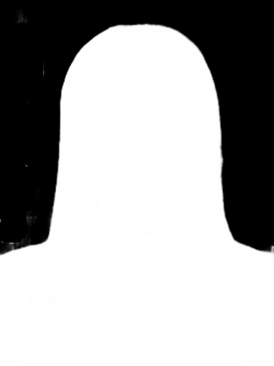

# Person Segmenation

change 2

## Overview

Данный репозиторий содержит код обучения и инференса модели сегментации человека на изображении/видео.

## Dataset

В качестве датасета был взять один из самых больших наборов данных с портретными изображениями - [AISegment.com - Matting Human Datasets]( https://www.kaggle.com/datasets/laurentmih/aisegmentcom-matting-human-datasets).

Набор данных содержит 34427 изображений и соответствующих им масок. Для обучения модели нейронной сети была взята случайная выборка:
* train - 1360 изображений
* val - 120 изображений
* test - 120 изображений

Исходные изображения в наборе данных взяты с Flickr, Baidu и Taobao. Размер каждого изображения -  600\*800 пикселей (WxH). Также каждому изображению соотвествует маска. 
Маска представлена ниже на рисунке 2. Данная маска формата PNG и имеет 4 канала. 4 канал соответсвует черно-белой маске (рисунок 3), которая и используется при обучении.

Маску можно извлечь следующим образом:
```
mask_path = "mask.png"
In_image = cv2.imread(mask_path, cv2.IMREAD_UNCHANGED)  
Alpha = in_image[:,:,3]
```

Пример изображения и маски:

<p align="middle">
  
  
   
</p>


## Project structure

Проект имеет следующую структуру:
* data - папка для хранения набора данных
* experiments - папка для логгирования моделей и всех дополнительных артефактов, при каждом новом запуске внутри создается папка с номером эксперимента:
  * exp1
  * exp2
  * ...
* model - папка со всеми основными скриптами
  * trainer.py - скрипт, реализующий класс обучения модели
  * utils - папка, содержащая дополнительные скрипты
    * dataset.py - скрипт, реализующий класс CustomDataset для загрузки и обработки данных
    * augmentations.py - скрипт, содержащий необходимые аугментации данных
    * plots.py - скрипт, содержащий отрисовку дополнительных артефактов
* tasks.py - скрипт для запуска необходимых этапов (обучение, инференс)
* invoke.yml - конфиг-файл, где указаны все необходимые параметры для обучения и инференса
* requirements.txt - файл, содержащий все необходимые зависимости библиотек и фреймворков

## Invoke

Для запуска всех необходимых экспериментов был использован фреймворк **Invoke** ([документация](https://www.pyinvoke.org/)).

Invoke — это библиотека для управления подпроцессами, ориентированными на оболочку, и организации исполняемого кода Python в задачи, вызываемые через CLI. Созддание Invoke было вдохновлено следующими фреймворками (make/rake, Fabric 1.x и т.д.).

Invoke предоставляет чистый высокоуровневый API для запуска команд оболочки и определения/организации функций задач из файла `tasks.py`.

Посмотреть доступные задачи можно с помощью команды `inv -l`.

Запуск команд:

```
inv train
inv inference
```

Для запуска также потребуется конфиг-файл `invoke.yml`, где указаны вся необходимая информация для обучения: batch size, image size, num_epochs и др.

## Logging

Для проведения экспериментов и сохранения необходимых результатов обучения моделей была добавлена система трекинга экспериментов - WandB (Weights&Biases). 

Логи проводимых экспериментов можно посмотреть по следующей ссылке: https://wandb.ai/cv-itmo/human_segmentation?workspace=user-dmitryai

Также для локального сохранения результатов используется логирование файлов в папку `experiments`, которая должны быть создана при запуске обучения. Во время обучения в ней создаются подпапка:

* pics 
* weights (сохранение весов моделей и модели в разных форматах)

## Training

Для обучения модели сегментации была использована библиотека `segmentation_models_pytorch`, где реализованы необходимые модели, энкодеры, метрики для задачи сегментации.

В качестве базовой модели была использована модель `Unet++` с энкодером *resnet18*, лоссом *SoftBCEWithLogitsLoss* и метрикой скора - *IoU*.

Полученные метрики на тестовой выборке:
* SoftBCEWithLogitsLoss: 0.05542415240779519
* IoU score: 0.971861906349659

## Inference

В качестве инференса модели производится запуск веб-камеры и сегмантацией на ней человека. Область, на которой нет человека, дополнительно размыта для понимания работы модели.

